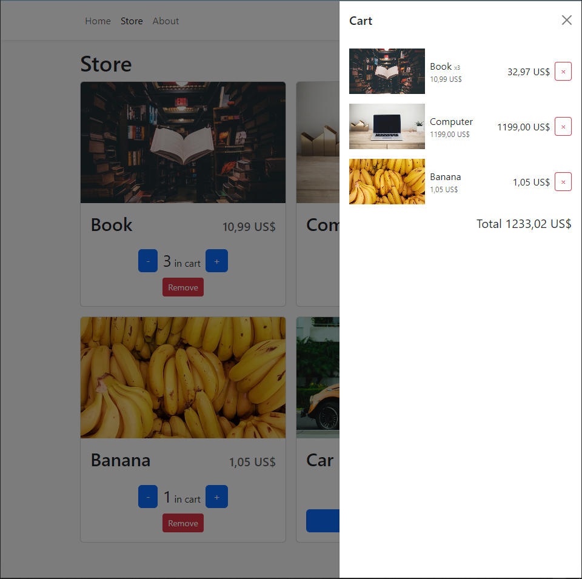

# React Shopping Cart app.

In this project we have multiple pages, the only page that has content is the 'Store' page. The important aspect of different pages is that we can go to other pages (besides 'Store') and we can still interact with the shopping cart, its going to work around multiple pages, and items in cart wont be removed when page is refreshed, cart items wil be stored locally.

Another objective of this project is to practice advanced features to build large scale projects like Routing, creating custom hooks, and a correct folder structure.

Used technologies:

- React + TypeScript.
- Bootstrap.
- React Router.
